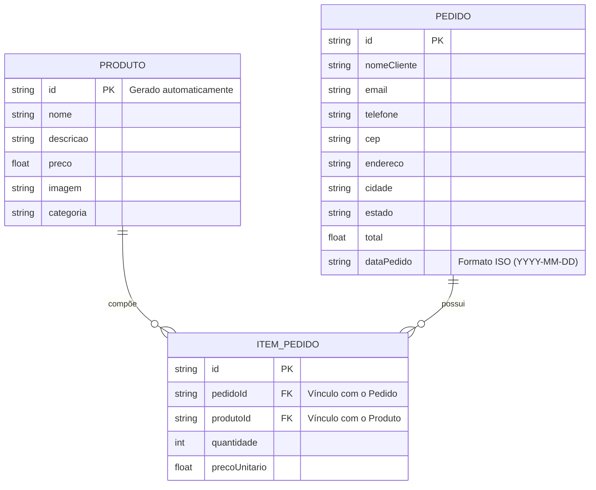

# 🛠️ Especificação Técnica (Tech Spec) - MR SNKRS

Este documento detalha a arquitetura técnica, o modelo de dados e os contratos de API (via JSON Server) necessários para o funcionamento do e-commerce MR SNKRS.

---

## 1. Modelo de Dados (Diagrama ER)

Abaixo está o Diagrama Entidade-Relacionamento (DER) que representa a estrutura do nosso "banco de dados" (`db.json`) e como as informações se conectam.



---

## 2. Dicionário de Dados

Breve explicação das entidades principais:

- **Produtos:** Responsável por armazenar os itens disponíveis para venda na loja.
  - id: Identificador único gerado pelo JSON Server.
  - nome: Nome do produto.
  - descricao: Informações detalhadas do produto.
  - preco: Valor numérico (Float).
  - imagem: URL da imagem do produto.
  - categoria: Classificação do produto (ex: casual, esportivo).

- **Pedidos:** Representa a finalização de uma compra realizada pelo usuário.
  - id: Identificador único do pedido.
  - nomeCliente: Nome informado no checkout.
  - email: Email do cliente.
  - telefone: Número de contato.
  - cep: CEP informado para entrega.
  - endereco, cidade, estado: Dados preenchidos automaticamente via API de CEP.
  - total: Valor total da compra.
  - dataPedido: Data no formato ISO.

- **Itens do Pedido:** Relaciona os produtos comprados dentro de um pedido.
  - pedidoId: Chave estrangeira que vincula o item ao pedido.
  - produtoId: Chave estrangeira que vincula o item ao produto.
  - quantidade: Quantidade do produto no pedido.
  - precoUnitario: Preço do produto no momento da compra.

---

## 3. Rotas da API (JSON Server)

A aplicação consome uma API local simulada pelo JSON Server. Abaixo estão os principais endpoints:

- `GET /produtos` - Retorna a lista de produtos.
- `GET /produtos?id=1` - Retorna um produto específico.
- `POST /pedidos` - Registra um novo pedido.
- `GET /pedidos` - Lista todos os pedidos realizados.
- `GET /itensPedido?pedidoId=1` - Retorna os itens de um pedido específico.

---

## 4. Estrutura do Banco de Dados (db.json)

Esta é a representação em formato JSON do banco de dados simulado.

```json
{
  "produtos": [
    {
      "id": "1",
      "nome": "Nike Air Force 1",
      "descricao": "Tênis clássico com design atemporal",
      "preco": 599.9,
      "imagem": "assets/images/airforce1.webp",
      "categoria": "casual"
    }
  ],
  "pedidos": [],
  "itensPedido": []
}
```

---

## 5. Considerações Técnicas

- O carrinho de compras será armazenado utilizando localStorage.
- A API fake será implementada com JSON Server.
- O sistema consumirá uma API pública para preenchimento automático de endereço (CEP).
- O projeto não terá autenticação de usuários.
- As imagens serão otimizadas utilizando formatos modernos como WebP.

---
